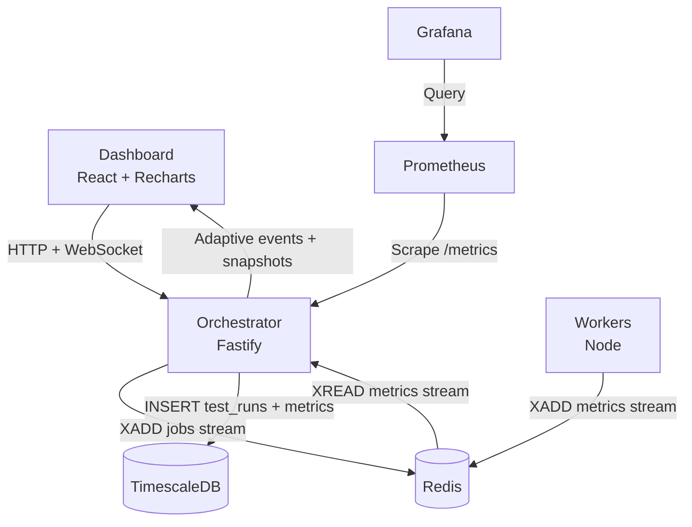
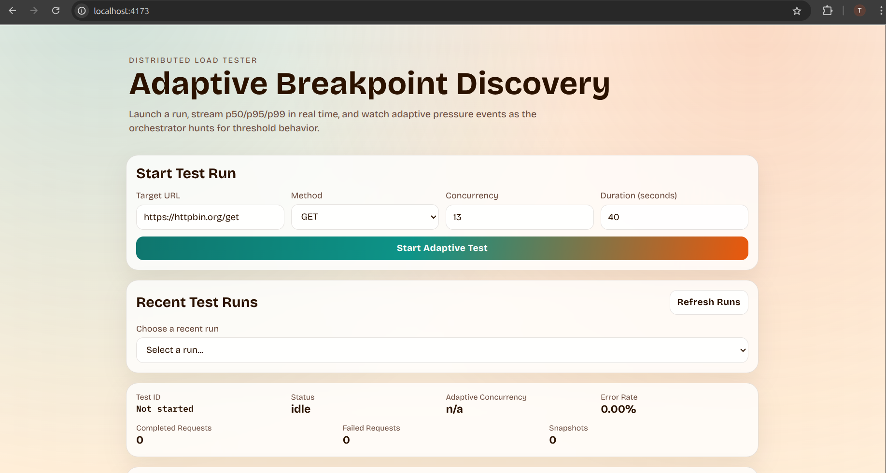
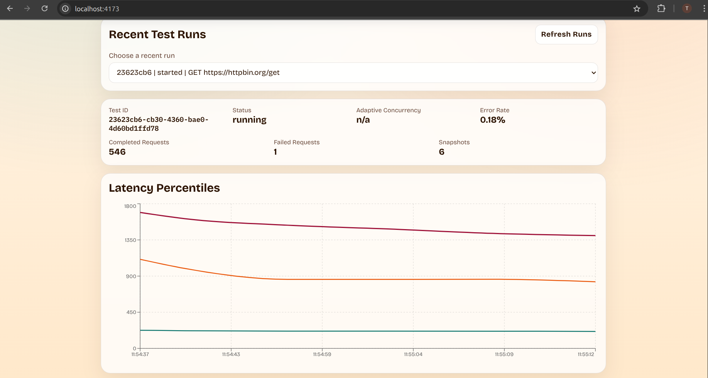
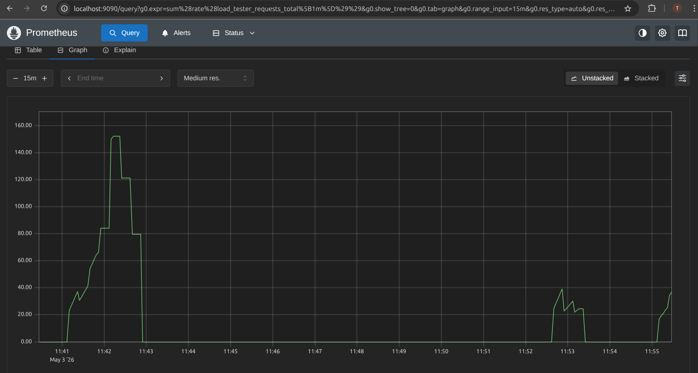
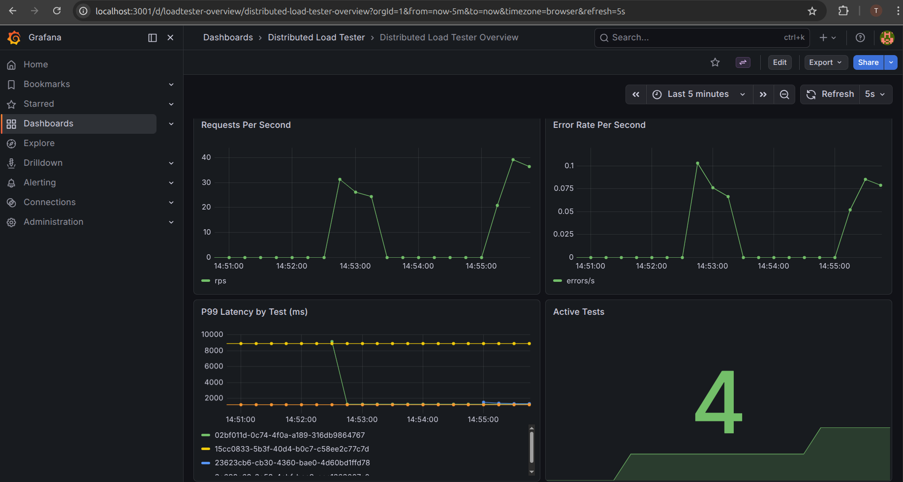

# Distributed Load Tester

Adaptive distributed load testing engine for finding HTTP endpoint breakpoints based on live latency and error behavior.

## What It Does

- Starts load tests through an orchestrator API.
- Dispatches jobs to worker processes through Redis Streams.
- Workers execute concurrent HTTP traffic and publish p50/p95/p99 snapshots.
- Orchestrator ingests worker snapshots, evaluates adaptive control rules, and emits live events.
- Dashboard visualizes latency curves and adaptive status in real time.

## Architecture



Supporting infra in local stack:

- Redis
- TimescaleDB
- Prometheus
- Grafana

## Monorepo Layout

- `apps/orchestrator`: API + adaptive controller + metrics ingestion loop.
- `apps/worker`: Redis consumer + HTTP load generator.
- `apps/dashboard`: React dashboard for run creation and live charting.
- `packages/shared`: shared TypeScript contracts.
- `infra/*`: k8s/helm/terraform/prometheus assets.

## Quick Start (Docker Compose)

Requirements:

- Docker + Docker Compose

Commands:

```bash
docker compose up -d --build
```

Services:

- Dashboard: `http://localhost:4173`
- Orchestrator API: `http://localhost:3000`
- Grafana: `http://localhost:3001` (admin/admin)
- Prometheus: `http://localhost:9090`
- TimescaleDB: `localhost:5433`
- Redis: `localhost:6379`

Stop stack:

```bash
docker compose down
```

## Demo Walkthrough

Use this short flow when presenting the project:

1. Start stack with `docker compose up -d --build`.
2. Open dashboard at `http://localhost:4173` and create a 30-second test.
3. Open Prometheus at `http://localhost:9090` and query:
  - `load_tester_active_tests`
  - `sum(rate(load_tester_requests_total[1m]))`
  - `sum(rate(load_tester_errors_total[1m]))`
4. Open Grafana at `http://localhost:3001` (admin/admin).
5. Verify auto-provisioned dashboard exists:
  - Folder: `Distributed Load Tester`
  - Dashboard: `Distributed Load Tester Overview`

Suggested screenshot set for CV/repo:

- Dashboard run view while test is active.
- Prometheus graph showing requests/error-rate queries.
- Grafana overview dashboard with p99 and active tests panels.

## Screenshots

Add your captures to `docs/screenshots/` with the filenames below so they render automatically on GitHub.

### 1) Dashboard Before Run



State before starting a test.

### 2) Dashboard Live Run



Live p50/p95/p99 updates while the test is running.

### 3) Prometheus Query



`sum(rate(load_tester_requests_total[1m]))` during an active run.

### 4) Grafana Overview



Auto-provisioned dashboard with RPS, error rate, p99 latency, and active tests.

## Kubernetes Deployment (Minikube)

For a complete orchestrated deployment (ideal for demonstrations):

### Prerequisites

- [Minikube](https://minikube.sigs.k8s.io/) installed
- `kubectl` CLI
- Docker (for building images)

### Setup & Deployment

1. **Start minikube cluster:**

```bash
minikube start --cpus=4 --memory=4096
```

2. **Configure shell to use minikube's Docker daemon** (so images build inside the cluster):

```bash
eval $(minikube docker-env)
```

3. **Build Docker images** (inside minikube):

```bash
docker build -t orchestrator:local ./apps/orchestrator
docker build -t worker:local ./apps/worker
docker build -t dashboard:local ./apps/dashboard
```

4. **Deploy the full stack** using Kustomize:

```bash
kubectl apply -k infra/k8s/
```

This deploys:
- `load-tester` namespace
- Redis (Deployment)
- TimescaleDB (StatefulSet with persistent volume)
- Orchestrator (Deployment with readiness/liveness probes)
- Workers (Deployment with horizontal pod autoscaler, 1-12 replicas based on CPU)
- Dashboard (Deployment)
- Prometheus (metrics collection)
- Grafana (dashboarding)

5. **Port forward to access services** (in separate terminals):

```bash
# Dashboard (React UI)
kubectl port-forward -n load-tester svc/dashboard 4173:4173

# Orchestrator API
kubectl port-forward -n load-tester svc/orchestrator 3000:3000

# Grafana
kubectl port-forward -n load-tester svc/grafana 3001:3000

# Prometheus
kubectl port-forward -n load-tester svc/prometheus 9090:9090
```

6. **Access services:**

- Dashboard: `http://localhost:4173`
- Orchestrator API: `http://localhost:3000`
- Grafana: `http://localhost:3001` (admin/admin)
- Prometheus: `http://localhost:9090`

### Example Test Run (in Kubernetes)

```bash
# Create a test
curl -X POST http://localhost:3000/tests \
  -H "Content-Type: application/json" \
  -d '{
    "targetUrl": "https://httpbin.org/delay/1",
    "method": "GET",
    "concurrency": 5,
    "durationSeconds": 30
  }'

# Watch live metrics in Grafana/Prometheus
# Visit http://localhost:3001 → Distributed Load Tester → Distributed Load Tester Overview
```

### Cleanup

```bash
# Delete all resources
kubectl delete -k infra/k8s/

# Stop minikube cluster
minikube stop

# Delete minikube cluster (optional)
minikube delete
```

## Local Development (without Docker)

Install dependencies:

```bash
npm install
```

Run all workspace dev commands:

```bash
npm run dev
```

Or run apps individually:

```bash
npm run -w orchestrator dev
npm run -w worker dev
npm run -w dashboard dev
```

Dashboard environment variables (optional):

- `VITE_ORCHESTRATOR_HTTP` (default: `http://localhost:3000`)
- `VITE_ORCHESTRATOR_WS` (default: `ws://localhost:3000`)

## API

- `POST /tests`: create a test run and enqueue a job.
- `GET /tests/:testId`: fetch status and accumulated metrics.
- `DELETE /tests/:testId`: stop a test run.
- `GET /tests/:testId/live` (WebSocket): stream metrics and adaptive events.

Minimal create payload:

```json
{
  "targetUrl": "https://httpbin.org/get",
  "method": "GET",
  "concurrency": 10,
  "durationSeconds": 15
}
```

## Adaptive Logic (Current)

After baseline establishment:

- If error rate > 5%: emit `threshold_found` and pause.
- If p99 > 2x baseline: reduce concurrency by 20% and emit `backing_off`.
- If p99 < baseline: increase concurrency by 10% and emit `ramping_up`.
- If stable for 30s: increase concurrency by 10% and emit `ramping_up`.

## Testing and Build

Run package tests:

```bash
npm run -w worker test
npm run -w orchestrator test
```

Run full monorepo build:

```bash
npm run build
```

## Current Gaps

- Multi-run comparison UX in dashboard can be improved.
- Helm chart and Terraform are optional future work if you want cloud-production packaging.
- Public demo URL is not included by default (local docker/minikube workflows are documented).
